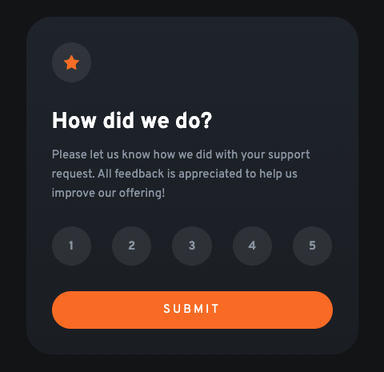

# Frontend Mentor - Interactive rating component solution

This is a solution to the [Interactive rating component challenge on Frontend Mentor](https://www.frontendmentor.io/challenges/interactive-rating-component-koxpeBUmI). Frontend Mentor challenges help you improve your coding skills by building realistic projects. 

## Table of contents

- [Overview](#overview)
  - [The challenge](#the-challenge)
  - [Screenshot](#screenshot)
  - [Links](#links)
- [My process](#my-process)
  - [Built with](#built-with)
  - [What I learned](#what-i-learned)
- [Author](#author)

## Overview

### The challenge

Users should be able to:

- View the optimal layout for the app depending on their device's screen size
- See hover states for all interactive elements on the page
- Select and submit a number rating
- See the "Thank you" card state after submitting a rating

### Screenshot



### Links

- Solution URL: [https://github.com/Jun-Ueno/interactive-rating-component](https://github.com/Jun-Ueno/interactive-rating-component)
- Live Site URL: [https://jun-ueno.github.io/interactive-rating-component/](https://jun-ueno.github.io/interactive-rating-component/)

## My process

### Built with

- Semantic HTML5 markup
- CSS custom properties
- Flexbox
- CSS Grid
- Mobile-first workflow

### What I learned

Learned a lot about Javascript button behaviors and a little about CSS-in-JS.

```js
let button = document.querySelector('button');

button.addEventListener('click', () => {
  // console.log('Button clicked!');
  document.querySelector('.start').classList.add('hidden');
  document.querySelector('.end').classList.remove('hidden');
  document.querySelector("#rate").innerHTML = value;
})
```

## Author

- Frontend Mentor - [@Jun-Ueno](https://www.frontendmentor.io/profile/Jun-Ueno)
- LinkedIn - [jun-ueno-5a558163](https://www.linkedin.com/in/jun-ueno-5a558163/)
